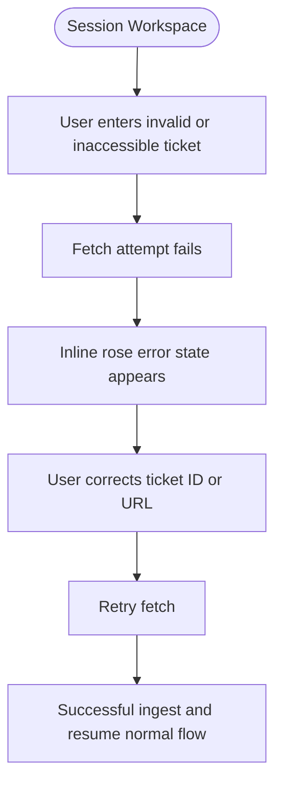

---
stepsCompleted:
  - step-01-init
  - step-02-discovery
  - step-03-core-experience
  - step-04-emotional-response
  - step-05-inspiration
  - step-06-design-system
  - step-07-defining-experience
  - step-08-visual-foundation
  - step-09-design-directions
  - step-10-user-journeys
  - step-11-component-strategy
  - step-12-ux-patterns
  - step-13-responsive-accessibility
  - step-14-complete
inputDocuments:
  - _bmad-output/planning-artifacts/prd.md
  - _bmad-output/planning-artifacts/prd-validation-report.md
  - docs/REQUIREMENT.md
user_preferences:
  - mobile responsiveness
---

# UX Design Specification qe-agent-v2

**Author:** Chamath
**Date:** 2026-03-08

---

<!-- UX design content will be appended sequentially through collaborative workflow steps -->

## Executive Summary

### Project Vision

BDD-AutoGen is currently expressed as a focused Epic 1 web experience that turns Jira tickets into editable BDD assets with minimal friction. The implemented UI centers on a stakeholder-friendly, browser-based flow: ingest a Jira ticket, generate BDD scenarios, refine them in-editor, and export the result for downstream QA usage.

### Target Users

QA Engineers, SDETs, and technically fluent product stakeholders who need a fast, readable way to turn ticket intent into test-ready Gherkin without navigating a dense developer console.

### Key Design Challenges

- **Mobile Responsiveness:** Desktop-primary experience; mobile-optimised for Report and History views only — code editors and complex forms remain desktop experiences.
- **Long-Running Operation Feedback:** Operations still need to feel transparent, but the presentation has shifted from verbose terminal logs to concise status cards, loaders, and progress indicators that are easier to read in demos.
- **Credential UX:** Inline contextual prompts on first use (e.g. when triggering Jira ingestion without a configured token) — no buried Settings page.
- **Scope Compression for Demo Readability:** The current surface area intentionally emphasizes the shortest successful loop (Ticket → Generate → Edit → Download) rather than exposing every future pipeline capability at once.

### Design Opportunities

- **Stakeholder-Friendly Delivery Surface:** Present a polished light theme that still feels credible to technical users while being easier to scan during walkthroughs.
- **Clear Action Hierarchy:** Use color, spacing, and elevation to make the next action obvious: fetch the ticket, generate BDD, then export.
- **Editing Confidence:** Pair a calm status panel with a stronger, more legible editor experience so users feel safe making quick text-level adjustments before download.
- **Extensible Demo Foundation:** Keep the UI structure simple enough to absorb future chat, verification, and reporting steps without redesigning the visual system again.

## Core User Experience

### Defining Experience

The core implemented loop is: Paste Jira ticket → Fetch ticket content → Generate BDD → Edit in Monaco → Download output. The single most critical interaction to get right is **Jira ticket input and ingestion** — everything flows from this moment. Second in importance: inline BDD editing that feels like a native code editor, not a web form.

### Platform Strategy

- **Primary:** Web application (browser-based, desktop, mouse + keyboard)
- **Secondary:** Mobile-optimised for Report viewing and Session History only
- No offline mode required — all operations depend on external APIs (Jira, GitHub, LLM)
- Keyboard-friendly editing remains important, but the current UI prioritizes visible CTA buttons and straightforward visual guidance for demos.

### Effortless Interactions

Interactions that must require zero thought:

- **Starting a session** — prominent landing-page CTA with no extra setup friction
- **Fetching a Jira ticket** — single input plus a clearly emphasized action button
- **Generating BDD** — a distinct secondary CTA enabled only when ticket content is ready
- **Downloading `.feature` and CSV** — single-click, no confirmation modal
- **Editing BDD** — click directly into textarea, cursor appears where clicked; no "edit mode" toggle

### Critical Success Moments

| Moment | Significance |
|---|---|
| First successful Jira ingestion | Validates setup is working; builds initial trust |
| First BDD generation | Core promise delivered — traceable scenarios appear |
| First successful edit in the BDD editor | Confirms the output is usable, not locked AI text |
| Feature or CSV download | Bridges to existing team workflows immediately |
| Re-opening a session URL | Reinforces that the workspace is a persistent working surface |

### Experience Principles

1. **Pipeline-First:** UI reflects the pipeline stage — the user always knows exactly where they are in the workflow.
2. **Guide the Next Action:** The interface should always make the next click obvious without adding a wizard.
3. **Fail Loudly, Recover Silently:** Errors are clear and specific; recovery never costs the user their work or session state.
4. **Editable Output Over Static Output:** Generated BDD is a starting point the user can trust and reshape.
5. **Desktop-First, Mobile-Sensible:** Full experience on desktop; portable reading states on mobile.

## Desired Emotional Response

### Primary Emotional Goals

**Primary: Clear + Capable** — Users feel they can move quickly without decoding the interface.
Every interaction reinforces: "I know what this screen is doing, and I can trust the result enough to act on it."

**Secondary: Calm Confidence** — The UI should reduce friction and demo anxiety.
Progress states, readable spacing, and familiar editor patterns make the experience feel stable rather than experimental.

### Emotional Journey Mapping

| Stage | Desired Feeling | Avoid |
|---|---|---|
| Landing page | Oriented, interested | Generic SaaS blandness |
| Jira input | In control | Anxious about credentials |
| Ingestion wait | Reassured | Impatient, uncertain |
| BDD review | Validated | Suspicious |
| BDD editing | Natural, fluid | Constrained |
| Download moment | Accomplished, ready to share | Anticlimactic |
| Returning user | Familiar, efficient | Lost |

### Micro-Emotions

| Pair | Target | Design Lever |
|---|---|---|
| Confidence vs. Confusion | Confidence | Strong CTA hierarchy and explicit status copy |
| Trust vs. Scepticism | Trust | Editable output plus clear loading states |
| Calm vs. Anxiety | Calm | Friendly light palette and visible progress bar |
| Accomplishment vs. Frustration | Accomplishment | Quick generation plus direct download actions |
| Delight vs. Satisfaction | Satisfaction | Intentional polish rather than novelty |
| Trust vs. Isolation | Trust | Consistent session-based workspace |

### Design Implications

| Emotion | UX Approach |
|---|---|
| Clear + Capable | Light layout, minimal clicks, obvious CTA hierarchy |
| Trusted output | Ticket fetch and generation feed directly into an editable Monaco surface |
| Reassured during waits | Status card, spinner, and progress bar instead of noisy log output |
| Natural editing | Poppins for interface clarity, monospace inside the editor, line numbers and direct editing |
| Accomplishment at export | Immediate export controls for `.feature` and CSV |
| Familiar on return | Session route remains the stable workspace shell |

### Emotional Design Principles

1. **Amplify Competence, Don't Overshadow It:** The UI should feel polished without becoming theatrical.
2. **Make the Next Action Obvious:** Each screen should answer “what do I do next?” at a glance.
3. **Make Waits Feel Safe:** Loading states should reassure, not overwhelm.
4. **Treat Generated Content as Working Material:** The editor is central, not decorative.
5. **Never Make Returning Feel Like Starting:** Session persistence is still the emotional foundation.

## UX Pattern Analysis & Inspiration

### Inspiring Products Analysis

- **Linear:** Premium B2B clarity, strong layout hierarchy, and polished but restrained surfaces.
- **Notion Calendar / modern Atlassian surfaces:** Light, readable enterprise UI that still feels work-oriented.
- **Raycast marketing/workspace crossover:** Useful reference for blending product polish with tool credibility.

### Transferable UX Patterns

- **Guided Hero + Workspace Pairing:** A clear entry screen followed by a task-focused editor workspace.
- **Status Summary Cards:** Replace noisy log feeds with concise status messaging, spinners, and progress bars.
- **Carded Two-Column Layout:** Status/supporting context on the left and the main editor/output surface on the right.
- **Mixed Typography:** Human-friendly sans-serif for interface copy, monospace only where the content is technical.

### Anti-Patterns to Avoid

- **Overly Terminal-Like Presentation:** Dense log streams and dark-console styling for a demo-first experience.
- **Modal Editing Traps:** Forcing users into modal popups to edit BDD scenarios.
- **Flat Consumer Genericism:** White screens with no hierarchy, emphasis, or sense of progress.
- **Blank Entry Experience:** Landing without a clear explanation of the three-step flow.

### Design Inspiration Strategy

- **Adopt:** Linear-like hierarchy and polished spacing; modern enterprise light-theme readability.
- **Adapt:** Developer-tool credibility into a lighter, more presentable demo surface.
- **Avoid:** Terminal nostalgia, over-verbose progress feeds, and washed-out generic dashboards.

## Design System Foundation

### Design System Choice

**shadcn/ui** (utilized alongside Tailwind CSS and Radix Primitives).

### Rationale for Selection

- **Developer-Native Aesthetic with Product Polish:** Unopinionated baseline that can support a technical editor surface while still feeling presentable in stakeholder demos.
- **Total Component Control:** Because components are copied into the repository rather than installed as an opaque dependency, we have full CSS and logic control. This is critical for adapting standard `textareas` into BDD editor-like interfaces.
- **Speed to Market:** Provides complex, accessible components out of the box (e.g., Steppers, Progress bars, Dialogs, Tables) without sacrificing visual uniqueness, perfectly fitting MVP constraints.

### Implementation Approach

- **Tech Stack Alignment:** Fully compatible with the Next.js (App Router) tech stack specified in the PRD.
- **Theme Strategy:** Implement a custom light-theme schema anchored in sky, blue, and indigo tones, with restrained borders and soft elevation to keep the product readable and modern.

### Customization Strategy

- **Granular Tweaks:** Modify core components like the `ScrollArea` and `Textarea` to mimic native code editors (hidden scrollbars until hover, monospace font enforcement).
- **Bypass Component Bloat:** Only install the specific components required by the pipeline, keeping the application bundle lean.

## Defining Experience

### Defining Experience

The defining interaction of the current product is the **"Jira-to-BDD Conversion Moment"**. It is the point where a user enters a Jira ticket, waits through a visible but calm status sequence, and receives editable Gherkin scenarios in a real editor. This is the interaction that proves the product can turn raw requirement text into usable testing assets quickly.

### User Mental Model

**Current Mental Model:** "Turning Jira acceptance criteria into BDD means copying text around, rewriting it manually, and cleaning up formatting before anyone can use it."
**New Mental Model:** "The system turns the ticket into a solid draft immediately, and I only need to refine and export it."

### Success Criteria

- **Fast Practical Output:** The generation feels fast enough to keep momentum and the output lands directly in an editable workspace.
- **Immediate Usefulness:** Users can download a feature file or CSV without needing to transform the output elsewhere.
- **Low Demo Friction:** A stakeholder can understand the flow from layout alone before any explanation is given.

### Novel UX Patterns

We are combining three familiar patterns into a single focused workflow:
1. **A product-style landing page:** clearly states the promise and the three-step flow.
2. **A task-focused workspace:** keeps the input, status, and editor visible together.
3. **A code-editor interaction model:** generated text is immediately editable, not trapped in a read-only AI output card.

### Experience Mechanics

1. **Initiation:** User starts from the landing page and opens a new session.
2. **Interaction (Fetch):** User enters a Jira ticket ID or URL and triggers ingestion.
3. **Interaction (The Wait):** A status card shows a concise message, spinner, and progress bar while the system fetches or generates.
4. **Feedback (The Reveal):** BDD scenarios appear inside Monaco with syntax highlighting and direct editability.
5. **Completion:** The user exports the output as `.feature` or CSV and can continue refining if needed.

## Visual Design Foundation

### Color System

- **Theme:** Light-mode primary. Backgrounds blend soft sky, blue, and white gradients to create atmosphere without harming readability.
- **Primary Accent:** Sky blue for ticket-fetch and navigation-entry actions.
- **Secondary Accent:** Blue/indigo for BDD generation, completion, and success-oriented states.
- **Support Accent:** Lighter blue surfaces for transitional information cards and secondary emphasis.
- **Error Accent:** Rose remains reserved for failures or credential/runtime issues.
- **Text:** Slate-900 / Slate-600 hierarchy for strong readability in bright conditions.

### Typography System

- **Interface Sans-serif:** Poppins. Used across landing, workspace, actions, and supporting copy to create a friendlier but still controlled product voice.
- **Technical Monospace:** Geist Mono. Applied to session IDs, file-oriented labels, and editor-adjacent technical fragments.
- **Editor Typography:** Monaco-controlled monospace rendering remains the technical reading surface for Gherkin content.
- **Type Scale:** Slightly larger than the original dense draft, anchored around a ~17px base body size for demo readability.

### Spacing & Layout Foundation

- **Spacing System:** Strict 4px base grid.
- **Layout Principle:** Moderate density with clear grouping. Use light borders, soft shadowing, and rounded cards to separate functional zones.
- **Structure:** Landing page hero plus flow card, then a two-column session workspace with status/support content on the left and the editor surface on the right.

### Accessibility Considerations

- **Contrast:** Strict adherence to WCAG AA minimums (4.5:1) for all text and accent surfaces against the light UI backgrounds.
- **Color Independence:** PASS/FAIL states must not rely on color alone — they must include clear iconography (✅ and ❌) for color-blind users.

## Design Direction Decision

### Design Directions Explored

Two directions were explored and visualized in `ux-design-directions.html`:

1. **The Utility Workspace:** A lighter but still compact workspace prioritizing immediate access to the editor and operational status.
2. **The Guided Demo Canvas:** A more expressive landing-and-workspace system with stronger CTA hierarchy, friendlier cards, and clearer stakeholder readability.

### Chosen Direction

**Direction 2: The Guided Demo Canvas**

### Design Rationale

- **Approachable Power:** The current UI still respects technical workflows, but it now reads well in walkthroughs and stakeholder reviews.
- **Hierarchy Without Noise:** Soft gradients, colored surfaces, and rounded cards clarify where to look next without turning the product into a marketing site.
- **Demo Credibility:** The design now better matches the actual Epic 1 goal: show a clear, polished, end-to-end Jira-to-BDD story quickly.

### Implementation Approach

- **Base Layer:** light gradient backgrounds mixing sky, blue, and white tones.
- **Panel Structure:** rounded cards with subtle borders and soft shadowing.
- **Borders:** pale sky/blue-tinted 1px borders that keep the UI crisp without harsh contrast.
- **Loading States:** spinner plus progress bar inside a status card rather than live terminal feed.

## User Journey Flows

### Journey 1: Epic 1 Demo Flow

### Journey 2: Ticket Retry / Correction Flow

### Journey 3: Return to Session Flow

### Journey Patterns

| Pattern | Applied In |
|---|---|
| **Prominent Entry CTA** | Landing page hero makes session start immediate and obvious |
| **Inline Ticket Handling** | Ticket fetch begins directly from the main workspace without extra setup views |
| **Status Card Loading** | Ingestion and generation use concise status copy, spinner, and progress bar |
| **Persistent Editor Surface** | Generated BDD remains editable in-place after completion |
| **Immediate Export Controls** | `.feature` and CSV downloads remain visible in the editor header |

### Flow Optimization Principles

1. **Keep the critical loop short:** Ticket input, generation, editing, and export should happen on one clear path.
2. **Keep errors local to the task:** Validation and runtime issues appear near the ticket controls rather than in detached banners or modals.
3. **Keep progress calm:** Use status summaries and loader affordances instead of verbose operational transcripts.

## Component Strategy

### Design System Components

The project continues to lean on standard **shadcn/ui** primitives and Tailwind utility composition for shells and controls:
- **Structure:** `Card`, `Separator`, `ScrollArea`
- **Data/State:** `Badge`, inline status surfaces, editor header controls
- **Forms/Actions:** `Button`, `Input`, `Label`

### Custom Components

The current Epic 1 experience depends on these custom product-facing components:

#### 1. Landing Hero + Demo Flow Card
- **Purpose:** Explain the product promise immediately and direct users into the session flow.
- **Anatomy:** left-aligned value proposition, primary CTA, and a three-step summary card.
- **Visual Tone:** light blue palette, rounded elevation, friendly typography.

#### 2. TerminalProgressLog (status-card presentation)
- **Purpose:** Maintain backend progress awareness without rendering raw event logs to the user.
- **Anatomy:** status heading, concise copy, spinner, progress bar, and step summary cards.
- **States:** idle, fetching ticket, generating BDD, complete, and error.
- **Note:** the component name is retained from earlier implementation history even though the visual design is no longer terminal-like.

#### 3. BDDEditorPanel
- **Purpose:** Native-feeling code editor for reviewing and modifying generated Gherkin.
- **Anatomy:** editor header, export controls, upload action, syntax-highlighted Monaco surface.
- **Interaction:** direct editing, mobile read-only protection, and download actions in the same panel.

### Component Implementation Strategy

- **Primitive Composition:** Build visual polish by composing simple primitives rather than introducing a heavy design abstraction layer.
- **Typography Discipline:** Use Poppins for interface surfaces and monospace rendering only where technical reading is required.
- **Color Semantics:** Reserve sky for fetch/initiation, blue for generation, indigo for ready/download states, and rose for failure.

### Implementation Roadmap

- **Phase 1 (Current):** Landing page, session workspace, status panel, and BDD editor for Jira-to-BDD generation.
- **Phase 2 (Next UX layer):** Expand the same design system into verification, reporting, and history screens.
- **Phase 3 (Operational polish):** Add richer saved-session and credential-management experiences while preserving the same light visual system.

## UX Consistency Patterns

### Button Hierarchy

- **Primary Action:** strongest gradient treatment; used for session start and ticket fetch entry points.
- **Secondary Action:** blue/indigo emphasis; used for BDD generation and completion-oriented actions.
- **Utility Action:** low-noise bordered pills for upload and download tools.
- **Destructive / Error Context:** rose messaging only when recovery or attention is needed.

### Feedback Patterns

- **Inline Validation Errors:** red/rose text rendered within the workspace near the triggering input.
- **Operational Feedback:** concise status text, spinner, and progress bar in the left status card.
- **Completion Feedback:** success is communicated through status color, ready state, and enabled download actions rather than celebratory animations.

### Form Patterns

- **Layout:** main ticket input sits at the top of the workspace as the primary task control.
- **Speed:** one visible field, one obvious fetch action, one obvious follow-up action.
- **Contextual Capture:** operational errors and credential issues should be surfaced inline where the user is already working.

### Navigation Patterns

- **Landing to Workspace:** a single clear transition from marketing/entry surface into the working session.
- **Session Persistence:** session ID remains visible in the workspace shell so the route feels durable and resumable.
- **Keyboard Accessibility:** the workspace should remain tab-navigable and editing-centric for technical users.

## Responsive Design & Accessibility

### Responsive Strategy

BDD-AutoGen remains **desktop-first** because the central editing task is best served by a full editor surface.

- **Desktop (1024px+):** full landing and workspace experience with two-column editor/status layout.
- **Tablet (768px - 1023px):** content stacks vertically while preserving full task flow.
- **Mobile (320px - 767px):** supporting access only; the editor should remain effectively read-only and simplified.

### Breakpoint Strategy

- `md` (768px): stack workspace surfaces and reduce editing affordances.
- `lg` (1024px): restore full two-column session layout.

### Accessibility Strategy

Target: **WCAG 2.1 AA**

- **Color Contrast:** all slate text, accent surfaces, and rose error states must maintain AA contrast on light backgrounds.
- **Keyboard Navigation:** visible focus states remain mandatory for ticket controls, action buttons, and editor-adjacent actions.
- **Screen Readers:** loading, ready, and error states should be represented with meaningful text rather than color alone.

### Implementation Guidelines

1. Preserve the desktop-first Monaco experience while keeping mobile surfaces safe and readable.
2. Keep loader meaning textual; spinner and progress bar should support the copy, not replace it.
3. Continue using accessible Radix/shadcn primitives where they reduce custom a11y work.
