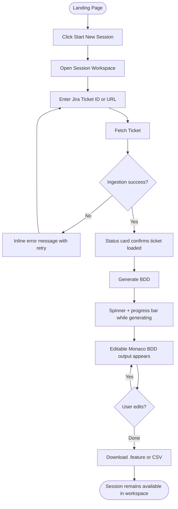
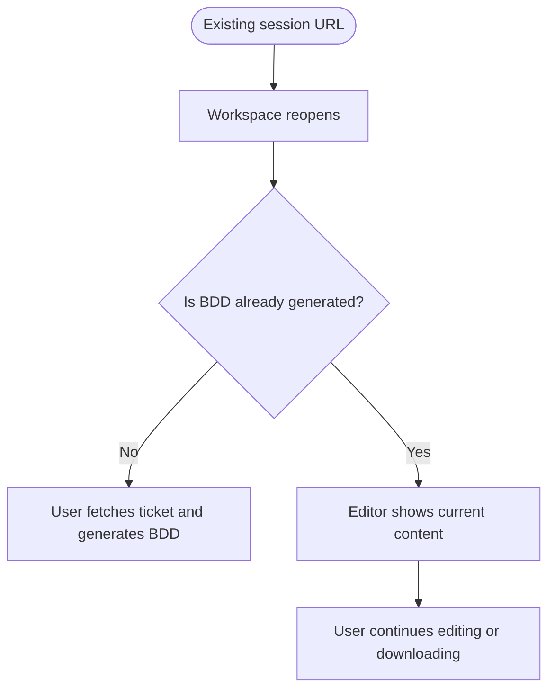

---
stepsCompleted:
  - step-01-init
  - step-02-discovery
  - step-03-core-experience
  - step-04-emotional-response
  - step-05-inspiration
  - step-06-design-system
  - step-07-defining-experience
  - step-08-visual-foundation
  - step-09-design-directions
  - step-10-user-journeys
  - step-11-component-strategy
  - step-12-ux-patterns
  - step-13-responsive-accessibility
  - step-14-complete
inputDocuments:
  - _bmad-output/planning-artifacts/prd.md
  - _bmad-output/planning-artifacts/prd-validation-report.md
  - docs/REQUIREMENT.md
user_preferences:
  - mobile responsiveness
---

# UX Design Specification qe-agent-v2

**Author:** Chamath
**Date:** 2026-03-08
**Revised:** 2026-08-22 — visual system replaced

> **Amended 2026-08-22** ([maintenance record](../implementation-artifacts/maintenance-2026-08-22-ui-redesign-feature-file.md)):
> The sky/blue/indigo light-only system this document originally specified was
> replaced by the **"feature file"** direction. The sections below marked
> *Design System Foundation*, *Visual Design Foundation*, *Design Direction
> Decision*, *Component Strategy*, *UX Consistency Patterns* and *Responsive
> Design & Accessibility* have been rewritten to match what is built.
> Everything else — user research, emotional goals, journey flows — still holds.
> `frontend/src/app/globals.css` is the source of truth for tokens.

---

<!-- UX design content will be appended sequentially through collaborative workflow steps -->

## Executive Summary

### Project Vision

BDD-AutoGen is currently expressed as a focused Epic 1 web experience that turns Jira tickets into editable BDD assets with minimal friction. The implemented UI centers on a stakeholder-friendly, browser-based flow: ingest a Jira ticket, generate BDD scenarios, refine them in-editor, and export the result for downstream QA usage.

### Target Users

QA Engineers, SDETs, and technically fluent product stakeholders who need a fast, readable way to turn ticket intent into test-ready Gherkin without navigating a dense developer console.

### Key Design Challenges

- **Mobile Responsiveness:** Desktop-primary experience; mobile-optimised for Report and History views only — code editors and complex forms remain desktop experiences.
- **Long-Running Operation Feedback:** Operations still need to feel transparent, but the presentation has shifted from verbose terminal logs to concise status cards, loaders, and progress indicators that are easier to read in demos.
- **Credential UX:** Inline contextual prompts on first use (e.g. when triggering Jira ingestion without a configured token) — no buried Settings page.
- **Scope Compression for Demo Readability:** The current surface area intentionally emphasizes the shortest successful loop (Ticket → Generate → Edit → Download) rather than exposing every future pipeline capability at once.

### Design Opportunities

- **Stakeholder-Friendly Delivery Surface:** Present a polished light theme that still feels credible to technical users while being easier to scan during walkthroughs.
- **Clear Action Hierarchy:** Use color, spacing, and elevation to make the next action obvious: fetch the ticket, generate BDD, then export.
- **Editing Confidence:** Pair a calm status panel with a stronger, more legible editor experience so users feel safe making quick text-level adjustments before download.
- **Extensible Demo Foundation:** Keep the UI structure simple enough to absorb future chat, verification, and reporting steps without redesigning the visual system again.

## Core User Experience

### Defining Experience

The core implemented loop is: Paste Jira ticket → Fetch ticket content → Generate BDD → Edit in Monaco → Download output. The single most critical interaction to get right is **Jira ticket input and ingestion** — everything flows from this moment. Second in importance: inline BDD editing that feels like a native code editor, not a web form.

### Platform Strategy

- **Primary:** Web application (browser-based, desktop, mouse + keyboard)
- **Secondary:** Mobile-optimised for Report viewing and Session History only
- No offline mode required — all operations depend on external APIs (Jira, GitHub, LLM)
- Keyboard-friendly editing remains important, but the current UI prioritizes visible CTA buttons and straightforward visual guidance for demos.

### Effortless Interactions

Interactions that must require zero thought:

- **Starting a session** — prominent landing-page CTA with no extra setup friction
- **Fetching a Jira ticket** — single input plus a clearly emphasized action button
- **Generating BDD** — a distinct secondary CTA enabled only when ticket content is ready
- **Downloading `.feature` and CSV** — single-click, no confirmation modal
- **Editing BDD** — click directly into textarea, cursor appears where clicked; no "edit mode" toggle

### Critical Success Moments

| Moment | Significance |
|---|---|
| First successful Jira ingestion | Validates setup is working; builds initial trust |
| First BDD generation | Core promise delivered — traceable scenarios appear |
| First successful edit in the BDD editor | Confirms the output is usable, not locked AI text |
| Feature or CSV download | Bridges to existing team workflows immediately |
| Re-opening a session URL | Reinforces that the workspace is a persistent working surface |

### Experience Principles

1. **Pipeline-First:** UI reflects the pipeline stage — the user always knows exactly where they are in the workflow.
2. **Guide the Next Action:** The interface should always make the next click obvious without adding a wizard.
3. **Fail Loudly, Recover Silently:** Errors are clear and specific; recovery never costs the user their work or session state.
4. **Editable Output Over Static Output:** Generated BDD is a starting point the user can trust and reshape.
5. **Desktop-First, Mobile-Sensible:** Full experience on desktop; portable reading states on mobile.

## Desired Emotional Response

### Primary Emotional Goals

**Primary: Clear + Capable** — Users feel they can move quickly without decoding the interface.
Every interaction reinforces: "I know what this screen is doing, and I can trust the result enough to act on it."

**Secondary: Calm Confidence** — The UI should reduce friction and demo anxiety.
Progress states, readable spacing, and familiar editor patterns make the experience feel stable rather than experimental.

### Emotional Journey Mapping

| Stage | Desired Feeling | Avoid |
|---|---|---|
| Landing page | Oriented, interested | Generic SaaS blandness |
| Jira input | In control | Anxious about credentials |
| Ingestion wait | Reassured | Impatient, uncertain |
| BDD review | Validated | Suspicious |
| BDD editing | Natural, fluid | Constrained |
| Download moment | Accomplished, ready to share | Anticlimactic |
| Returning user | Familiar, efficient | Lost |

### Micro-Emotions

| Pair | Target | Design Lever |
|---|---|---|
| Confidence vs. Confusion | Confidence | Strong CTA hierarchy and explicit status copy |
| Trust vs. Scepticism | Trust | Editable output plus clear loading states |
| Calm vs. Anxiety | Calm | Friendly light palette and visible progress bar |
| Accomplishment vs. Frustration | Accomplishment | Quick generation plus direct download actions |
| Delight vs. Satisfaction | Satisfaction | Intentional polish rather than novelty |
| Trust vs. Isolation | Trust | Consistent session-based workspace |

### Design Implications

| Emotion | UX Approach |
|---|---|
| Clear + Capable | Light layout, minimal clicks, obvious CTA hierarchy |
| Trusted output | Ticket fetch and generation feed directly into an editable Monaco surface |
| Reassured during waits | Per-stage pipeline status, a run spinner, a progress track, and the live log tail |
| Natural editing | Monospace throughout, themed Monaco, line numbers and direct editing |
| Accomplishment at export | Immediate export controls for `.feature` and CSV |
| Familiar on return | Session route remains the stable workspace shell |

### Emotional Design Principles

1. **Amplify Competence, Don't Overshadow It:** The UI should feel polished without becoming theatrical.
2. **Make the Next Action Obvious:** Each screen should answer “what do I do next?” at a glance.
3. **Make Waits Feel Safe:** Loading states should reassure, not overwhelm.
4. **Treat Generated Content as Working Material:** The editor is central, not decorative.
5. **Never Make Returning Feel Like Starting:** Session persistence is still the emotional foundation.

## UX Pattern Analysis & Inspiration

### Inspiring Products Analysis

- **Linear:** Premium B2B clarity, strong layout hierarchy, and polished but restrained surfaces.
- **Notion Calendar / modern Atlassian surfaces:** Light, readable enterprise UI that still feels work-oriented.
- **Raycast marketing/workspace crossover:** Useful reference for blending product polish with tool credibility.

### Transferable UX Patterns

- **Guided Hero + Workspace Pairing:** A clear entry screen followed by a task-focused editor workspace.
- **Status Summary Cards:** Replace noisy log feeds with concise status messaging, spinners, and progress bars.
- **Carded Two-Column Layout:** Status/supporting context on the left and the main editor/output surface on the right.
- **Mixed Typography:** Human-friendly sans-serif for interface copy, monospace only where the content is technical.

### Anti-Patterns to Avoid

- **Overly Terminal-Like Presentation:** Dense log streams and dark-console styling for a demo-first experience.
- **Modal Editing Traps:** Forcing users into modal popups to edit BDD scenarios.
- **Flat Consumer Genericism:** White screens with no hierarchy, emphasis, or sense of progress.
- **Blank Entry Experience:** Landing without a clear explanation of the three-step flow.

### Design Inspiration Strategy

- **Adopt:** Linear-like hierarchy and polished spacing; modern enterprise light-theme readability.
- **Adapt:** Developer-tool credibility into a lighter, more presentable demo surface.
- **Avoid:** Terminal nostalgia, over-verbose progress feeds, and washed-out generic dashboards.

## Design System Foundation

### Design System Choice

**shadcn/ui** (utilized alongside Tailwind CSS and Radix Primitives).

### Rationale for Selection

- **Developer-Native Aesthetic with Product Polish:** Unopinionated baseline that can support a technical editor surface while still feeling presentable in stakeholder demos.
- **Total Component Control:** Because components are copied into the repository rather than installed as an opaque dependency, we have full CSS and logic control. This is critical for adapting standard `textareas` into BDD editor-like interfaces.
- **Speed to Market:** Provides complex, accessible components out of the box (e.g., Steppers, Progress bars, Dialogs, Tables) without sacrificing visual uniqueness, perfectly fitting MVP constraints.

### Implementation Approach

- **Tech Stack Alignment:** Fully compatible with the Next.js (App Router) tech stack specified in the PRD.
- **Theme Strategy:** A **dual light/dark token system**, both palettes complete and first-class. The shadcn/base-ui variable contract is preserved and remapped onto semantic tokens, so stock primitives keep working. `ThemeProvider` writes `.dark` on `<html>`; the choice (`light | dark | system`, default `system`) persists in `localStorage` and is painted before first paint by an inlined init script.

### Customization Strategy

- **Token-first, never literal:** Components reference semantic tokens (`bg-card`, `border-rule`, `text-pass-ink`) or the shared component classes. Hard-coded Tailwind colour utilities (`slate-*`, `sky-*`, `emerald-*`, `rose-*`) are prohibited — they are what broke dark mode the first time.
- **Granular Tweaks:** Monaco is themed to match the app palette in both modes (`gherkin-light` / `gherkin-dark`), so the editor reads as part of the product rather than an embedded third-party surface.
- **Bypass Component Bloat:** Only the primitives the pipeline needs are kept in `components/ui/`, hand-written against the token set rather than pulled in wholesale.

## Defining Experience

### Defining Experience

The defining interaction of the current product is the **"Jira-to-BDD Conversion Moment"**. It is the point where a user enters a Jira ticket, waits through a visible but calm status sequence, and receives editable Gherkin scenarios in a real editor. This is the interaction that proves the product can turn raw requirement text into usable testing assets quickly.

### User Mental Model

**Current Mental Model:** "Turning Jira acceptance criteria into BDD means copying text around, rewriting it manually, and cleaning up formatting before anyone can use it."
**New Mental Model:** "The system turns the ticket into a solid draft immediately, and I only need to refine and export it."

### Success Criteria

- **Fast Practical Output:** The generation feels fast enough to keep momentum and the output lands directly in an editable workspace.
- **Immediate Usefulness:** Users can download a feature file or CSV without needing to transform the output elsewhere.
- **Low Demo Friction:** A stakeholder can understand the flow from layout alone before any explanation is given.

### Novel UX Patterns

We are combining three familiar patterns into a single focused workflow:
1. **A product-style landing page:** clearly states the promise and the three-step flow.
2. **A task-focused workspace:** keeps the input, status, and editor visible together.
3. **A code-editor interaction model:** generated text is immediately editable, not trapped in a read-only AI output card.

### Experience Mechanics

1. **Initiation:** User starts from the landing page and opens a new session.
2. **Interaction (Fetch):** User enters a Jira ticket ID or URL and triggers ingestion.
3. **Interaction (The Wait):** A status card shows a concise message, spinner, and progress bar while the system fetches or generates.
4. **Feedback (The Reveal):** BDD scenarios appear inside Monaco with syntax highlighting and direct editability.
5. **Completion:** The user exports the output as `.feature` or CSV and can continue refining if needed.

## Visual Design Foundation

### Color System

The palette is **derived from the product's own output**: the thing qe-agent
produces is a verdict, so pass/fail *is* the brand colour rather than a
decorative accent laid on top.

- **Primary accent — pass green:** the colour that means "verified" is also the
  colour of the primary button. Tokens: `--pass` / `--pass-soft` / `--pass-ink`.
- **Failure — oxide red:** `--fail` / `--fail-soft` / `--fail-ink`. Reserved for
  a genuine failure or an unimplemented scenario.
- **In-progress / caution — amber:** `--pending` / `--pending-soft` /
  `--pending-ink`. Also used for a verification run that *completed with gaps* —
  that is the answer the user asked for, not an error.
- **Syntax — keyword violet:** `--keyword` / `--keyword-soft`. Used **only** for
  Gherkin keywords and knowledge-base context, never as a general accent.
- **Surfaces:** `--paper` (page), `--surface` / `--surface-raised` (panels),
  `--rule` / `--rule-strong` (hairlines). Panels are separated by 1px rules, not
  by drop shadows.

All values are `oklch()`, defined twice — light on `:root`, dark on `.dark`.

### Typography System

- **Display / interface — JetBrains Mono.** Headings, eyebrows, keywords, data
  and any machine-generated text. The type that names things matches the type
  that shows them.
- **Body — Instrument Sans.** Prose, descriptions, helper copy.
- **Editor Typography:** Monaco renders JetBrains Mono, themed to the app palette.
- **Type Scale:** ~15px base — denser than the previous 17px draft. Headings use
  tight negative tracking; eyebrows are uppercase mono at 11px / 0.16em.

### Spacing & Layout Foundation

- **Spacing System:** Strict 4px base grid.
- **One shell, one gutter:** `.app-shell` (`w-full`,
  `px-6 sm:px-10 lg:px-20 xl:px-32 2xl:px-40`) is the single container for the nav and for
  every page. It is **full-bleed with no max-width** — this is a workbench, and
  the editor, results table and comparison columns should use the whole
  monitor rather than sit inside a centred column with dead margins.
- **Measure belongs to the paragraph:** readable line length is set with
  `max-w-*` on the text element itself, never on a layout container. Capping a
  page's container is what made the nav and the content disagree on where the
  left edge is. The centred auth card on `/login` is the one exception.
- **Radius:** `--radius: 0.375rem` (6px). Deliberately small and rectilinear —
  a feature file is not a pill.
- **Layout Principle:** Structure carries meaning. The signature device is a
  **keyword gutter** — a hairline left rule, tinted by signal, shared by panels,
  pipeline stages, verdict rows and toasts (`.gutter-rule` +
  `data-signal="pass|fail|pending"`).
- **Structure:** Landing hero renders an actual `.feature` block as its thesis;
  the session workspace keeps the two-column status/editor split.

### Accessibility Considerations

- **Contrast:** WCAG AA (4.5:1) minimums hold in **both** palettes.
- **Color Independence:** PASS/FAIL never rely on colour alone. `VerdictBadge`
  carries a glyph as well as a tint, so the distinction survives a colour-vision
  difference or greyscale printing.
- **Motion:** `prefers-reduced-motion` collapses every animation globally.
- **Focus:** a single global `:focus-visible` outline in the pass green.

## Design Direction Decision

### Design Directions Explored

Three directions were considered for the 2026-08-22 redesign:

1. **Feature file:** the Gherkin document's own vocabulary becomes the design
   system — monospace headings, editor-style gutters, terminal status language.
2. **Engineering console:** dark-first, dense instrument panel, closer to a CI
   dashboard. Strong for the workspace, heavy for login and landing.
3. **Refined product UI:** light, generous, conventional modern SaaS. Safest,
   least distinctive.

### Chosen Direction

**Direction 1: Feature file**

*(The original 2026-03-08 decision — "The Guided Demo Canvas", visualised in
`ux-design-directions.html` — is superseded. That file documents the old system.)*

### Design Rationale

- **Grounded in the subject:** the artifact at the centre of the product is a
  `.feature` file, so the UI reads like one. Distinctiveness comes from the
  domain rather than from decoration.
- **The verdict is the point:** making pass/fail the palette rather than an
  accent means the interface's loudest signal is the thing the user came for.
- **Boldness spent once:** the keyword gutter is the one memorable device;
  everything around it stays quiet, which keeps a dense workspace legible.
- **Dark mode is real work, not a toggle:** QE engineers live in editors. The
  previous spec's light-only rule was the reason a full dark token set sat dead
  in the stylesheet.

### Implementation Approach

- **Base Layer:** flat `--paper` ground, no gradients.
- **Panel Structure:** `rounded-lg border border-rule bg-card` — hairline rules,
  no drop shadow.
- **Signal Surfaces:** `-soft` background + 30% border + `-ink` text, plus a
  `.gutter-rule` in the matching signal.
- **Loading States:** three registers — `RunSpinner` (braille cycler) for agent
  work, `Spinner` for a busy control, `SkeletonRows` for list content whose
  shape is known.

## User Journey Flows

### Journey 1: Epic 1 Demo Flow

### Journey 2: Ticket Retry / Correction Flow

### Journey 3: Return to Session Flow

### Journey Patterns

| Pattern | Applied In |
|---|---|
| **Prominent Entry CTA** | Landing page hero makes session start immediate and obvious |
| **Inline Ticket Handling** | Ticket fetch begins directly from the main workspace without extra setup views |
| **Status Card Loading** | Ingestion and generation use concise status copy, spinner, and progress bar |
| **Persistent Editor Surface** | Generated BDD remains editable in-place after completion |
| **Immediate Export Controls** | `.feature` and CSV downloads remain visible in the editor header |

### Flow Optimization Principles

1. **Keep the critical loop short:** Ticket input, generation, editing, and export should happen on one clear path.
2. **Keep errors local to the task:** Validation and runtime issues appear near the ticket controls rather than in detached banners or modals.
3. **Keep progress calm:** Use status summaries and loader affordances instead of verbose operational transcripts.

## Component Strategy

### Design System Components

The project keeps **shadcn/base-ui** primitives and Tailwind composition for
shells and controls, remapped onto the token set. `Button` gained a `loading`
prop that sets `aria-busy` and disables the control while keeping its label
readable.

### Shared Primitives

Built for the redesign and reused everywhere — new UI composes these rather than
re-deriving a look:

| Primitive | Purpose |
|---|---|
| `Panel` / `PanelHeader` / `PanelBody` | rule-bounded panel with eyebrow + title |
| `Field` / `Input` / `Textarea` / `Label` | labelled control with error wired for a11y |
| `Badge` / `VerdictBadge` | signal chip; verdicts carry a glyph as well as a colour |
| `EmptyState` / `ErrorState` | an empty screen names the next action, not just the absence |
| `Spinner` / `RunSpinner` / `InlineLoader` | busy control, agent work, labelled loading line |
| `Skeleton` / `SkeletonText` / `SkeletonRows` | placeholders for content of known shape |
| `ProgressBar` | determinate or indeterminate, `role="progressbar"` |
| `AppNav` / `Wordmark` / `PageHeader` / `ThemeToggle` | app chrome, previously duplicated per page |
| `ToastProvider` / `useToast()` | transient outcome feedback (see UX Consistency Patterns) |

### Custom Components

#### 1. Landing Hero
- **Purpose:** state the promise with the product's own artifact.
- **Anatomy:** value proposition, primary CTA, and a live `.feature` block with a
  blinking caret as the hero image.
- **Visual Tone:** flat ground, hairline-framed code panel, monospace display type.

#### 2. TerminalProgressLog
- **Purpose:** show where the run actually is.
- **Anatomy:** three pipeline stages (`Given` ingest -> `When` generate -> `Then`
  verify) with per-stage glyphs and detail, a progress track, and the **live SSE
  log tail** from `SessionContext.logs`.
- **States:** waiting, running, done, failed — per stage, so an ingest failure
  cannot paint the verify row red.
- **Note:** the component is now literally what its name says. The 2026-03-08
  spec's "status card rather than a terminal log" decision is reversed.

#### 3. BDDEditorPanel
- **Purpose:** native-feeling code editor for reviewing and modifying Gherkin.
- **Anatomy:** header with eyebrow + export/upload/save controls, and a Monaco
  surface themed to the active palette.
- **Interaction:** direct editing, mobile textarea fallback, toasts on save /
  upload / export, and a retained inline banner for upload errors.

### Component Implementation Strategy

- **Primitive Composition:** compose the shared primitives; do not re-derive a
  panel or a badge inline.
- **Typography Discipline:** JetBrains Mono for headings, keywords, data and
  machine output; Instrument Sans for prose.
- **Color Semantics:** pass green for verified and for primary actions, fail red
  for failure, pending amber for in-flight and for completed-with-gaps, keyword
  violet **only** for Gherkin keywords and knowledge-base context.

### Implementation Roadmap

- **Phase 1 (Complete):** token system, toast and loader primitives, dark mode,
  and all eight pages migrated.
- **Phase 2 (Next):** retire the remaining per-page one-off markup in favour of
  `Panel` / `PageHeader`, and add visual-regression coverage.
- **Phase 3:** richer saved-session and credential-management surfaces on the
  same token set.

## UX Consistency Patterns

### Button Hierarchy

- **Primary Action:** solid pass green (`variant="default"`). Session start, BDD
  generation, verification run, confirm.
- **Secondary Action:** `variant="outline"` — rule border on surface. Ticket
  fetch, exports, upload, cancel.
- **Utility Action:** `variant="ghost"` for low-noise chrome.
- **Destructive:** `variant="destructive"` — fail-soft ground that fills to solid
  fail on hover. Always behind `ConfirmModal`.
- **Busy:** any button takes `loading`, which shows a spinner, sets `aria-busy`
  and disables — the label stays readable rather than becoming "Loading…".

### Feedback Patterns

Two layers, deliberately kept distinct:

- **Toasts — transient outcomes.** Fire when an action *completes*, because the
  result may land off-screen. Variants `success | error | warning | info |
  loading`; errors persist 8s and use `role="alert"`. Portalled to `<body>`,
  capped at four, paused on hover.
- **Inline banners — state that belongs to the surface.** Kept for anything tied
  to a form or that must survive a reload: auth errors, `globalError` in the
  workspace, per-file rejection reasons, editor upload errors. **Toasts are
  additive — they did not replace inline validation.**

**Copy rule:** an action keeps its name through the whole flow. "Generate BDD"
resolves to "BDD generated", never "Success!". Errors say what broke and what to
do next, and do not apologise. A toast title must never duplicate an inline
note's text in the same panel.

**Loading register:** `RunSpinner` (braille cycler) for work the agent does on
the user's behalf; `Spinner` for a control that is busy; `SkeletonRows` for list
content whose shape is already known; `ProgressBar` when real progress is known.

### Form Patterns

- **Layout:** the ticket input is the top-level task control in the workspace,
  sticky beneath the nav.
- **Speed:** one visible field, one obvious fetch action, one obvious follow-up.
- **Accessibility:** `Field` wires label, control and error together; errors set
  `aria-invalid` and `aria-describedby`.

### Navigation Patterns

- **Single shared chrome:** `AppNav` is the one top bar for every page — the
  previous per-page link rows are what let them drift apart. It shares
  `.app-shell` with page content, so the wordmark and the page's first column
  sit on the same left edge.
- **Active state is a rule, not a chip:** the current section is marked by a
  pass-green indicator flush with the header's bottom border, continuing the
  hairline language rather than reverting to a filled pill. The bar takes a
  firmer border once the page scrolls beneath it.
- **Mobile navigation is a drawer:** below `md` a hamburger opens a right-hand
  sheet holding the links, the theme control and sign-out. It is a real modal —
  backdrop, body scroll lock, Escape to close, focus moved in and returned to
  the trigger, and Tab kept inside — because a nav that traps focus behind it is
  worse than no nav. Active rows reuse the signal gutter.
- **Session Persistence:** the session ID stays visible in the workspace shell.
- **Keyboard Accessibility:** a skip-to-content link precedes the nav; every page
  exposes `<main id="main">`; focus is visible everywhere.

## Responsive Design & Accessibility

### Responsive Strategy

qe-agent remains **desktop-first** because the central editing task is best
served by a full editor surface.

- **Desktop (1024px+):** full landing and workspace with the two-column
  status/editor layout.
- **Tablet (768px - 1023px):** content stacks vertically, full task flow intact.
- **Mobile (320px - 767px):** supporting access. Monaco is swapped for a plain
  textarea; chat input is hidden with an explanatory line; the nav links, theme
  control and sign-out collapse behind a hamburger into a right-hand drawer,
  leaving the bar itself to the wordmark and the page's own action.

### Breakpoint Strategy

- `md` (768px): stack workspace surfaces, swap the editor, collapse the nav
  behind the hamburger.
- `lg` (1024px): restore the full two-column session layout.

### Theme Strategy

Light and dark are both first-class and must be reviewed together. `.dark` is set
on `<html>` by `ThemeProvider`; `ThemeToggle` offers light / dark / system, and
`system` follows OS changes live. The stored theme is applied by an inlined
`<head>` script before first paint.

### Accessibility Strategy

Target: **WCAG 2.1 AA**, in both palettes.

- **Color Contrast:** every token pairing meets AA in light *and* dark.
- **Keyboard Navigation:** skip link, visible focus ring, and full tab access to
  ticket controls, actions and editor-adjacent tools.
- **Screen Readers:** loading, ready and error states carry text or an ARIA role
  — `role="status"` on skeletons and loaders, `role="alert"` on error toasts and
  inline errors, `role="progressbar"` with values on determinate progress.
- **Color Independence:** verdicts carry a glyph via `VerdictBadge`.
- **Motion:** `prefers-reduced-motion` collapses all animation globally.

### Implementation Guidelines

1. Reach for a shared primitive before writing new markup; if none fits, add one
   rather than styling in place.
2. Never hard-code a Tailwind colour utility. Use a semantic token or one of
   `.gutter-rule` / `.eyebrow` / `.kw` / `.panel`.
3. Check every change in both palettes. A screen that only works in light is not
   done.
4. Keep loader meaning textual — a spinner supports the copy, it does not replace
   it — and give every loading surface a role or an accessible name.
5. Preserve the desktop-first Monaco experience while keeping mobile surfaces
   safe and readable.
6. Continue using accessible Radix/base-ui primitives where they reduce custom
   a11y work.
