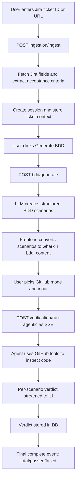
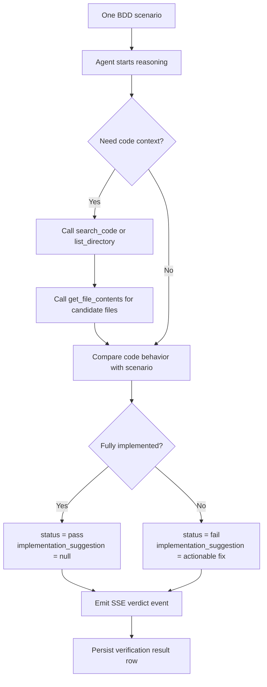

# Jira to Verification Flow (Simple)

## 1) What this app does

The app takes a Jira ticket, turns it into BDD scenarios, and verifies those scenarios against GitHub code.

Current runtime path uses **agentic verification** (one-step verification with GitHub tools).

## 2) End-to-end flow (easy view)

1. User enters Jira ticket ID or Jira URL in the Session page.
2. Backend fetches ticket content from Jira (summary, description, acceptance criteria).
3. Backend creates a session and stores the ticket context.
4. User clicks Generate BDD.
5. Backend runs BDD generation and returns structured scenarios.
6. Frontend converts scenarios into Gherkin text and shows/editable BDD content.
7. User selects GitHub source mode (exact files / full repo / pull request) and input.
8. User clicks Run Verification.
9. Backend runs agentic LLM verification scenario-by-scenario.
10. Frontend receives streaming verdicts (SSE), shows pass/fail rows live.
11. Backend stores each verdict in DB.
12. Final summary event arrives (total, passed, failed).

## 3) Inputs and outputs by stage

### A. Jira Ingestion

Endpoint: `POST /api/v1/ingestion/ingest`

Input:
- `ticket_id_or_url` (example: `QA-2` or full Jira URL)

Output:
- `session_id`
- `jira_ticket_id`
- `acceptance_criteria`
- `status` (usually `ready_for_bdd`)

Notes:
- Jira key is extracted from ID or URL.
- Service tries to find acceptance criteria field first; if not, falls back to description/summary.

### B. BDD Generation

Endpoint: `POST /api/v1/bdd/generate`

Input:
- `session_id`
- `acceptance_criteria`

Output:
- `scenarios[]` where each item has:
  - `source_ac_clause`
  - `feature`
  - `scenario`
  - `given`
  - `when`
  - `then`

Frontend then converts this to Gherkin text and uses it as `bdd_content`.

### C. Verification (Current = Agentic)

Endpoint: `POST /api/v1/verification/run-agentic` (SSE stream)

Input:
- `session_id`
- `bdd_content`
- `mode` (`exact_files` | `full_repo` | `pull_request`)
- `github_input` (depends on mode)

Streaming output events:
- `type=verdict` (one per scenario)
- `type=error` (if scenario or stream-level error)
- `type=complete` with:
  - `total`
  - `passed`
  - `failed`

Per-scenario verdict payload:
- `scenario_id`
- `scenario_title`
- `status` (`pass` or `fail`)
- `justification`
- `code_reference` (`file`, `function`, `line`)
- `github_links[]`
- `implementation_suggestion` (null for pass, actionable text for fail)

## 4) How fail suggestions are generated

When a scenario is marked `fail`, the model is instructed to return a concrete fix suggestion in `implementation_suggestion`.

Expected behavior:
- If `status=pass`: `implementation_suggestion` should be null.
- If `status=fail`: `implementation_suggestion` should be non-null and actionable.

Typical suggestion examples:
- Add missing validation path in a specific function.
- Add authorization check before performing an action.
- Handle error/edge case branch not covered in current code.

## 5) How verification actually decides pass/fail

For each BDD scenario:
1. Agent explores repository using tools (`search_code`, `list_directory`, `get_file_contents`).
2. Agent reads relevant source files.
3. Agent compares implementation behavior with scenario acceptance intent.
4. Agent returns structured verdict and evidence links.
5. Backend validates verdict schema and streams it to UI.
6. Backend persists verdict row to `verification_results`.

Safety guard:
- If GitHub tool calls fail completely (no successful reads), backend can force a fail due to incomplete verification.

## 6) Optional branch: manual BDD upload

Instead of generating BDD from Jira, user can upload a `.feature` file using `POST /api/v1/bdd/upload`.
Then verification runs the same way using uploaded `bdd_content`.

---

## Flowcharts

### Flowchart 1: Full app flow (Jira to verification)

### Flowchart 2: Verification internals (per scenario)

